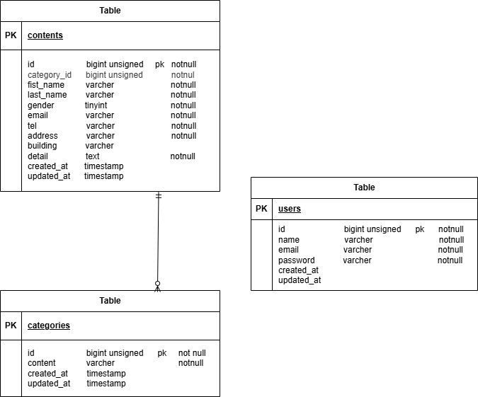

# 確認テスト

## 環境構築
 dockerビルド
・git clone git@github.com:michan450/test_app.git
・docker-compose up -d --build

 laravel環境構築
・docker-compose exec php bash
・composer install
・cp .env.example .env
・php artisan key:generate
・php artisan migrate

## 使用技術（実行環境）
・php:8.1-fpm
・laravel:8.6.12
・nginx:1.21.1
・mysql:8.0.26

## 開発環境
・お問い合わせ画面　:　http://localhost/
・ユーザー登録　：　http://localhost/register
・phpMyAdmin : http://localhost:8080/

## ER図

